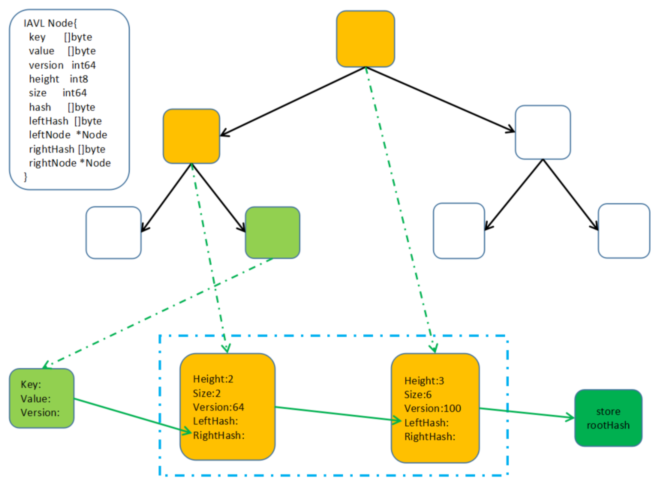
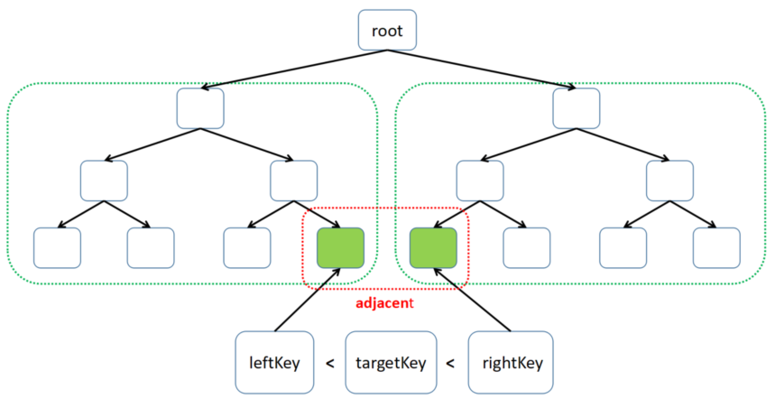
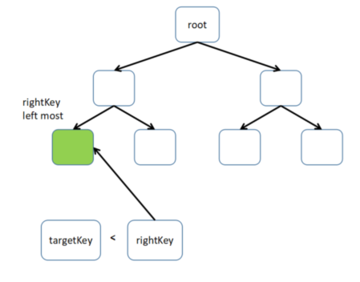
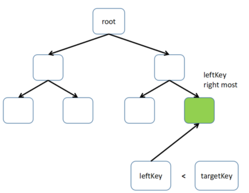
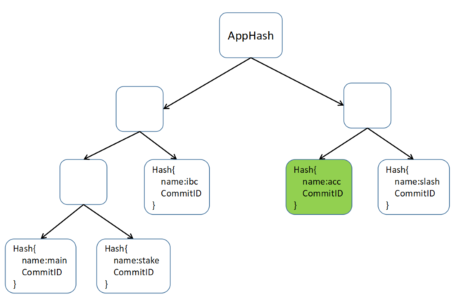

# Specifications

This specification describes how to implement the LCD. LCD supports modular APIs. Currently, only
ICS1 (Key API),ICS20 (Token API) and ICS21 (Staking API) are supported. Later, if necessary, more
APIs can be imported.

## Build and Verify Proof of ABCI States

As we all know,  storage of cosmos-sdk based application contains multi-substores. Each substore is
implemented by a IAVL store. These substores are organized by simple Merkle tree. To build the tree,
we need to extract name, height and store root hash from these substores to build a set of simple
Merkle leaf nodes, then calculate hash from leaf nodes to root. The root hash of the simple Merkle
tree is the AppHash which will be included in block header.


As we have discussed in [LCD trust-propagation](https://github.com/irisnet/cosmos-sdk/tree/bianjie/lcd_spec/docs/spec/lcd#trust-propagation), the AppHash can be verified by checking voting power against a trusted validator set. Here we just need to build proof 
from ABCI state to AppHash. The proof contains two parts:

* IAVL proof
* Substore to AppHash proof

1. **IAVL Proof**

The proof has two types: existance proof and absence proof. If the query key exists in the IAVL
store, then it returns key-value and its existance proof. On the other hand, if the key doesn't
exist, then it only returns absence proof which can demostrate the key definitely doesn't exist.

2. **IAVL Existance Proof**

```json
type CommitID struct {
		Version int64
		Hash    []byte
	}
	type storeCore struct {
		CommitID CommitID
	}
	type MultiStoreCommitID struct {
		Name string
		Core storeCore
	}
	type proofInnerNode struct {
		Height  int8
		Size    int64
		Version int64
		Left    []byte
		Right   []byte
	}
	type KeyExistsProof struct {
		MultiStoreCommitInfo []MultiStoreCommitID //All substore commitIDs
		StoreName string //Current substore name
		Height  int64 //The commit height of current substore
		RootHash cmn.HexBytes //The root hash of this IAVL tree
		Version  int64 //The version of the key-value in this IAVL tree
		InnerNodes []proofInnerNode //The path from to root node to key-value leaf node
	}
```

The data structure of exist proof is shown as above. The process to build and verify existance proof
is shown as follows:



Steps to build proof:

* Access the IAVL tree from the root node.
* Record the visited nodes in InnerNodes,
* Once the target leaf node is found, assign leaf node version to proof version
* Assign the current IAVL tree height to proof height
* Assign the current IAVL tree rootHash to proof rootHash
* Assign the current substore name to proof StoreName
* Read multistore commitInfo from db by height and assign it to proof StoreCommitInfo

Steps to verify proof:

* Build leaf node with key, value and proof version.
* Calculate leaf node hash
* Assign the hash to the first innerNode's rightHash, then calculate first innerNode hash
* Propagate the hash calculation process. If prior innerNode is the left child of next innerNode, then assign the prior innerNode hash to the left hash of next innerNode. Otherwise, assign the prior innerNode hash to the right hash of next innerNode.
* The hash of last innerNode should be equal to the rootHash of this proof. Otherwise, the proof is invalid.

3. **IAVL Absence Proof**

As we all know, all IAVL leaf nodes are sorted by the key of each leaf nodes. So we can calculate
the postition of the target key in the whole key set of this IAVL tree. As shown below, we can find
out the left key and the right key. If we can demonstrate that both left key and right key
definitely exist, and they are adjacent nodes. Thus the target key definitely doesn't exist.



If the target key is larger than the right most leaf node or less than the left most key, then the 
target key definitely doesn't exist.



```json
	type proofLeafNode struct {
		KeyBytes   cmn.HexBytes
		ValueBytes cmn.HexBytes
		Version    int64
	}
	type pathWithNode struct {
		InnerNodes []proofInnerNode
		Node proofLeafNode
	}
	type KeyAbsentProof struct {
		MultiStoreCommitInfo []MultiStoreCommitID
		StoreName string
		Height  int64
		RootHash cmn.HexBytes
		Left  *pathWithNode // Proof the left key exist
		Right *pathWithNode  //Proof the right key exist
	}
```

The above is the data structure of absence proof. Steps to build proof:

* Access the IAVL tree from the root node.
* Get the deserved index(Marked as INDEX) of the key in whole key set.
* If the returned index equals to 0, the right index should be 0 and left node doesn't exist
* If the returned index equals to the size of the whole key set, the left node index should be INDEX-1 and the right node doesn't exist.
* Otherwise, the right node index should be INDEX and the left node index should be INDEX-1
* Assign the current IAVL tree height to proof height
* Assign the current IAVL tree rootHash to proof rootHash
* Assign the current substore name to proof StoreName
* Read multistore commitInfo from db by height and assign it to proof StoreCommitInfo

Steps to verify proof:

* If only right node exist, verify its exist proof and verify if it is the left most node
* If only left node exist, verify its exist proof and verify if it is the right most node.
* If both right node and left node exist, verify if they are adjacent.

4. **Substores to AppHash Proof**

After verify the IAVL proof, then we can start to verify substore proof against AppHash. Firstly,
iterate MultiStoreCommitInfo and find the substore commitID by proof StoreName. Verify if yhe Hash
in commitID equals to proof RootHash. If not, the proof is invalid. Then sort the substore
commitInfo array by the hash of substore name. Finally, build the simple Merkle tree with all
substore commitInfo array and verify if the Merkle root hash equal to appHash.



```json
	func SimpleHashFromTwoHashes(left []byte, right []byte) []byte {
		var hasher = ripemd160.New()
		err := encodeByteSlice(hasher, left)
		if err != nil {
			panic(err)
		}
		err = encodeByteSlice(hasher, right)
		if err != nil {
			panic(err)
		}
		return hasher.Sum(nil)
	}
	func SimpleHashFromHashes(hashes [][]byte) []byte {
		// Recursive impl.
		switch len(hashes) {
			case 0:
				return nil
			case 1:
				return hashes[0]
			default:
				left := SimpleHashFromHashes(hashes[:(len(hashes)+1)/2])
				right := SimpleHashFromHashes(hashes[(len(hashes)+1)/2:])
				return SimpleHashFromTwoHashes(left, right)
		}
	}
```

## Verify block header against validator set

Above sections refer appHash frequently. But where does the trusted appHash come from? Actually,
appHash exist in block header, so next we need to verify blocks header at specific height against
LCD trusted validator set. The validation flow is shown as follows:


When the trusted validator set doesn't match the block header, we need to try to update our
validator set to the height of this block. LCD have a rule that each validator set change should not
affact more than 1/3 voting power. Compare with the trusted validator set, if the voting power of
target validator set changes more than 1/3. We have to verify if there are hidden validator set
change before the target validator set. Only when all validator set changes obey this rule, can our
validator set update be accomplished.

For instance:


* Update to 10000, tooMuchChangeErr
* Update to 5050,  tooMuchChangeErr
* Update to 2575, Success
* Update to 5050, Success
* Update to 10000,tooMuchChangeErr
* Update to 7525, Success
* Update to 10000, Success 

## Load Balancing

To improve LCD reliability and TPS, we recommend to connect LCD to more than one fullnode. But the
complexity will increase a lot. So load balancing module will be imported as the adapter. Please
refer to this link for detailed description: [load balancing](https://github.com/irisnet/cosmos-sdk/blob/bianjie/lcd_spec/docs/spec/lcd/loadbalance.md)

## ICS1 (KeyAPI)

1. **Query keys, [API introduction](https://github.com/irisnet/cosmos-sdk/blob/bianjie/lcd_spec/docs/spec/lcd/api.md#keys---get)**
* a. Load key store

```json
	db, err := dbm.NewGoLevelDB(KeyDBName, filepath.Join(rootDir, "keys"))
	if err != nil {
		return nil, err
	}
	keybase = client.GetKeyBase(db)
```
	
* b. Iterate the whole key store
```
	var res []Info
	iter := kb.db.Iterator(nil, nil)
	defer iter.Close()
	for ; iter.Valid(); iter.Next() {
		// key := iter.Key()
		info, err := readInfo(iter.Value())
		if err != nil {
			return nil, err
		}
		res = append(res, info)
	}
	return res, nil
```

* c. Encode address and public key to bech32 pattern
	```json
	bechAccount, err := sdk.Bech32ifyAcc(sdk.Address(info.PubKey.Address().Bytes()))
	if err != nil {
		return KeyOutput{}, err
	}
	bechPubKey, err := sdk.Bech32ifyAccPub(info.PubKey)
	if err != nil {
		return KeyOutput{}, err
	}
	return KeyOutput{
		Name:    info.Name,
		Address: bechAccount,
		PubKey:  bechPubKey,
	}, nil

```

2. **Import key, [API introduction](https://github.com/irisnet/cosmos-sdk/blob/bianjie/lcd_spec/docs/spec/lcd/api.md#keys---post)**

* a. Load key store
* b. Parameter checking. Name, password and seed should not be empty
* c. Key name duplication checking
* d. Build key from key name, password and seed
* e. Persist key to key store

3. **Generate seed, [API introduction](https://github.com/irisnet/cosmos-sdk/blob/bianjie/lcd_spec/docs/spec/lcd/api.md#keysseed---get)**

* a. Load mock key store to avoid key persistence
* b. Generate random seed and return

4. **Get key info by key name, [API introduction](https://github.com/irisnet/cosmos-sdk/blob/bianjie/lcd_spec/docs/spec/lcd/api.md#keysname---get)**

* a. Load key store
* b. Iterate the whole key store to find the key by name
* c. Encode address and public key to bech32 pattern

5. **Update key password, [API introduction](https://github.com/irisnet/cosmos-sdk/blob/bianjie/lcd_spec/docs/spec/lcd/api.md#keysname---put)**

* a. Load key store
* b. Iterate the whole key store to find the key by name
* c. Verify if the old-password match the current key password
* d. Re-persist the key with new password

6. **Delete key, [API introduction](https://github.com/irisnet/cosmos-sdk/blob/bianjie/lcd_spec/docs/spec/lcd/api.md#keysname---delete)**

* a. Load key store
* b. Iterate the whole key store to find the key by name
* c. Verify if the specified password match the current key password
* d. Delete the key from key store

## ICS20 (TokenAPI)

1. **Query asset information for specified account, [API introduction](https://github.com/irisnet/cosmos-sdk/blob/bianjie/lcd_spec/docs/spec/lcd/api.md#balanceaccount---get)**

	* a. Decode address from bech32 to hex
	* b. Send query request to a full node. Assert proof required in the request if LCD works on no-trust mode
	* c. Verify the proof against trusted validator set
	
2. **Build unsigned transaction for transferring asset, [API introduction](https://github.com/irisnet/cosmos-sdk/blob/bianjie/lcd_spec/docs/spec/lcd/api.md#create_transfer---post)**
  
	* a. Parameter checking
	* b. Build transaction with user specified parameters
	* c. Serialize the transaction and return the byte array

3. **Broadcast signed transaction for transferring asset, [API introduction](https://github.com/irisnet/cosmos-sdk/blob/bianjie/lcd_spec/docs/spec/lcd/api.md#signed_transfer---post)**

	* a. Users are supposed to sign the transaction byte array with their private key
	* b. Broadcast transaction and its signature to full node
	* c. Wait until the transaction is on chain and return the transaction hash

## ICS21 (StakingAPI)

1. **Get all validators' detailed information, [API introduction](https://github.com/irisnet/cosmos-sdk/blob/bianjie/lcd_spec/docs/spec/lcd/api.md#stakevalidators---get)**

	* a. Send query request to a full node
	* b. Decode the query result and return

2. **Get and verify the delegation information, [API introduction](https://github.com/irisnet/cosmos-sdk/blob/bianjie/lcd_spec/docs/spec/lcd/api.md#stakedelegatorbonding_statusvalidator---get)**

	* a. Verify and decode delegator address and validator address
	* b. Send query request to a full node. Assert proof required in the request if LCD works on no-trust mode
	* c. Verify the proof against trusted validator set
